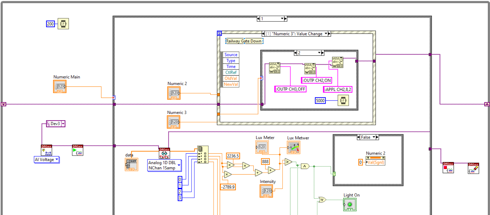

# Intelligent Street Lighting System with Automated Railway Gate
An intelligent street light system designed to enhance energy efficiency and urban safety.
Overview: The "Intelligent Street Lighting System with Automated Railway Gate" is an innovative project designed to enhance the efficiency and safety of urban and rural infrastructure. The system integrates smart street lighting with an automated railway gate mechanism to provide a dual solution for energy-saving and railway crossing safety. Developed using LabVIEW for sensor logic and control, the system uses various sensors to automate operations based on real-time conditions, ensuring optimal performance and minimal energy consumption.

